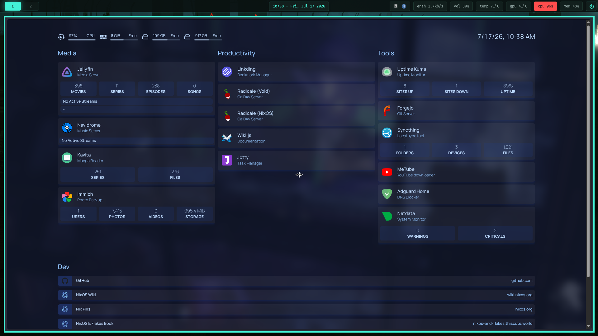

* nix-server

My personal NixOS configuration — desktop, laptop, and a self-hosted home lab, all managed as a single flake with Home Manager as a NixOS module and secrets encrypted with agenix.

** Hosts

|--------------+------------+--------------------------------------------------------------------------------------|
| Hostname     | Role       | Notes                                                                                |
|--------------+------------+--------------------------------------------------------------------------------------|
| =sylphiette= | 🖥️ Desktop | i3-7100, 16GB RAM, GTX 1050 Ti · static IP =192.168.1.200= · runs the home lab stack |
| =roxy=       | 💻 Laptop  | WIP                                                                                  |
| =eris=       | -          | -                                                                                    |
|--------------+------------+--------------------------------------------------------------------------------------|

** Structure

#+begin_src md
.
├── flake.nix                            # entrypoint: nixosConfigurations for sylphiette / roxy / eris
├── hosts/
│   ├── sylphiette/                      # configuration.nix, hardware-configuration.nix, users
│   └── roxy/
├── modules/
│   ├── nixos/                           # system-level modules
│   │   ├── core/                        # boot, locale, networking, nix settings, secrets
│   │   ├── desktop/                     # xserver, Plasma
│   │   ├── development/                 # Android, Docker, nix-ld
│   │   ├── hardware/                    # audio, bluetooth, NVIDIA, ydotool
│   │   ├── maintenance/                 # auto-upgrade
│   │   ├── programs/ & services/        # fish, ssh, printing, KDE Connect, touchpad, adb
│   │   ├── users/
│   │   └── window-managers/             # Hyprland, i3, Niri, Qtile
│   └── home-manager/                    # user-level modules
│       ├── profiles/                    # desktop.nix / laptop.nix entrypoints
│       ├── hyprland/ i3/ niri/ qtile/   # per-compositor config
│       ├── helix/                       # editor + LSPs
│       ├── kitty/ waybar/ dunst/ rofi.nix / fuzzel.nix
│       ├── shell/fish/                  # aliases, functions, keybinds
│       ├── ruby/                        # Rails dev environment
│       └── ...                          # git, tmux, emacs, neovim, vim, kdeconnect, android, packages
├── homelab/                             # one module per self-hosted service (see below)
├── packages/                            # Raku CLI tooling, packaged as Nix derivations
├── secrets/                             # agenix-encrypted secrets + secrets.nix
├── wallpaper/                           # wallpaper set used by the desktop
└── assets/                              # README screenshots
#+end_src

** Desktop environment

Multi-compositor setup, switched per-session depending on what I'm feeling:

- *i3* — single monitor (wip)
- *Niri* — main compositor (dual/triple monitor); uses Kanshi for dynamic output management instead of inline =output= configurations in =config.kdl=
- *Qtile* — triple monitor (wip)
- *Hyprland* — currently broken; planning to migrate from Hyprlang to Lua config

Shared across all of them: Waybar/panel, Fuzzel/Rofi launchers, Dunst notifications, Kitty (with a custom theme), Fish shell, Helix as the primary editor with a Doom Emacs daemon on standby, and tmux session management driven by [[https://raku.org][Raku]] scripts.

Notable fixes documented in-repo:

- Three-monitor layout, including a 32" TV as a third display
- Wayland/Emacs compatibility via =emacs-pgtk= under Niri
- KDE Connect split module: firewall rule lives in the NixOS module, the service itself in Home Manager
- Vue LSP in Helix — hybrid mode bundling =@vue/typescript-plugin= from the Nix store path
- Flutter on NixOS (SDK path resolution for Android Studio) + Brave pinned as =CHROME_EXECUTABLE=

** Home lab (=homelab/=)

Everything runs on the desktop host, fronted by **Caddy** as a reverse proxy on =*.home= domains, deployed as NixOS modules (Docker-only apps run via =virtualisation.oci-containers= on Podman), with all secrets managed through **agenix**.

Backups are automated with systemd timers — Nextcloud has daily backups with 7-day retention.

|--------------+------------------------------------------------------|
| Service      | Purpose                                              |
|--------------+------------------------------------------------------|
| [[https://jellyfin.org][Jellyfin]]     | Media server (hardware transcoding via NVENC)        |
| [[https://immich.app][Immich]]       | Photo/video backup [GPU-accelerated ML]              |
| [[https://nextcloud.com][Nextcloud]]    | File sync and share [self-hosted]                    |
| [[https://filebrowser.org][FileBrowser]]  | Web-based file manager                               |
| [[https://www.navidrome.org][Navidrome]]    | Music streaming                                      |
| [[https://www.kavitareader.com][Kavita]]       | Manga/book/comic library                             |
| [[https://forgejo.org][Forgejo]]      | Git hosting — migration target from GitHub           |
| [[https://github.com/dani-garcia/vaultwarden][Vaultwarden]]  | Password manager — planned, not yet deployed         |
| [[https://adguard.com/en/adguard-home/overview.html][AdGuard Home]] | Network-wide DNS ad-blocking                         |
| [[https://syncthing.net][Syncthing]]    | File sync across devices                             |
| [[https://radicale.org][Radicale]]     | CalDAV/CardDAV server                                |
| [[https://github.com/sissbruecker/linkding][Linkding]]     | Bookmark manager                                     |
| [[https://js.wiki][Wiki.js]]      | Personal wiki                                        |
| [[https://jotty.page][Jotty]]        | Notes                                                |
| [[https://github.com/alexta69/metube][MeTube]]       | yt-dlp download frontend                             |
| [[https://github.com/louislam/uptime-kuma][Uptime Kuma]]  | Uptime monitoring, with Discord notifications/alerts |
| [[https://www.netdata.cloud][Netdata]]      | Real-time metrics, alerts to Discord                 |
| [[https://gethomepage.dev][Homepage]]     | Dashboard for the whole stack                        |
|--------------+------------------------------------------------------|

Each service lives in its own =homelab/<service>/default.nix= for easy enable/disable and review.

** Scripting (=packages/=)

Raku-based CLI tools packaged as Nix derivations and wired into the shell:

- =tmux/= — session manager, plus a dedicated Ruby on Rails dev-environment launcher
- =powermenu/= — Wayland and X11 power menus
- =websearch/= — Wayland and X11 quick-search launchers
- =sync/= — sync helpers (notes, [[https://nekomangini.github.io][blog]], [[https://nekopaper.netlify.app][nekopaper]])
- =helix/=, =emacs/= — editor session helpers

** Usage

#+begin_src bash
# rebuild the desktop
sudo nixos-rebuild switch --flake .#sylphiette

# rebuild the laptop
sudo nixos-rebuild switch --flake .#roxy
#+end_src

Secrets are managed with agenix — see =secrets/secrets.nix= for the recipient list before rekeying.

** TODOs

- [ ] Migrate Hyprland configuration from Hyprlang to Lua
- [X] Enable GPU acceleration for machine learning in Immich
- [X] Clean up and reorganize packages
- [X] Migrate remaining GitHub repositories to Forgejo
- [ ] Deploy Vaultwarden
- [ ] Cleanup Raku scripts

** Screenshots

- 

-----

Also check out [[https://nekopaper.netlify.app][nekopaper]] for the companion wallpaper gallery app.
